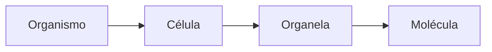

## Teste 1: Objetivos pessoais

    - Revisar conceitos de biologia
    - Revisar avanços na medicina
    - Aprender novos conceitos

# 1. Revolução na biologia

    - Medicina
    - DNA fingerprint
    - História evolutiva
    - Engenharia genética

## Teste 2: Descrever as informações recentes de que o DNA humano contém DNA neandertal

A ideia é que as duas espécies coexistiram em um momento da história, havendo cruzamento sexual.
Há cerca de 1,5%-2,1% de contribuição dos neandertais para o *H. sapiens* do ponto de vista evolutivo.
A imagem a sgeuir representa populações com material genético neandertal.


Fonte: https://revistapesquisa.fapesp.br/o-neandertal-em-cada-um-de-nos/

# 2. O que não está no curso
    - Diversidade da vida (foco no comum);
    - Evolução;
    - Biologia celular;

## Teste 3: Nível de diversidade da vida


## Teste 4

``` Maior tempo de evolução foi do surgimento de células eucarióticas após o surgimento das células procariotas (cerca de 2 bilhões de anos). Após o resfriamento da Terra, as primeiras células procariotas surgiram após 0.3 bilhões de anos.

Células eucariotas possuem núcleo (eukarya = núcleo verdadeiro), enquanto os procariontes não possuem

Óvulo: 130 um; Pele: 30 um; Cromossomo: 7 um; Mitocôndia: 4x0.8 um; *E. coli*: 3x0.6 um.
```

# 3. Conteúdo do curso
    - Funções biológicas:
        - Bioquímica;
        - Genética;
    - Biologia molecular (Dogma Central):
        - União da genética com bioquímica (DNA recombinante);


Fonte: Triangle. Sera Thornton, copyright 2013 Broad Institute.

## Teste 5:

```
Bioquímica: molécula de um indivíduo
Genética: organismo como um todo exceto uma molécula
```
